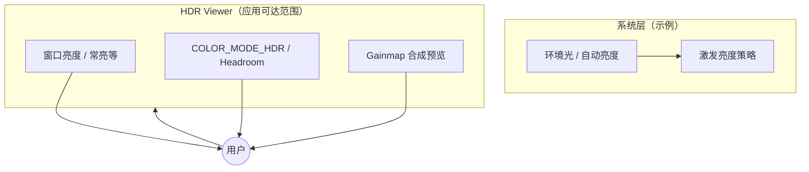
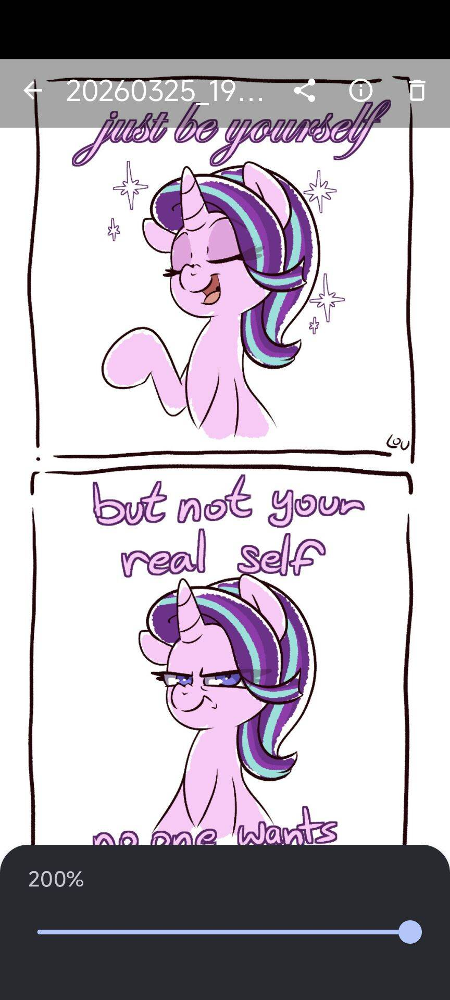
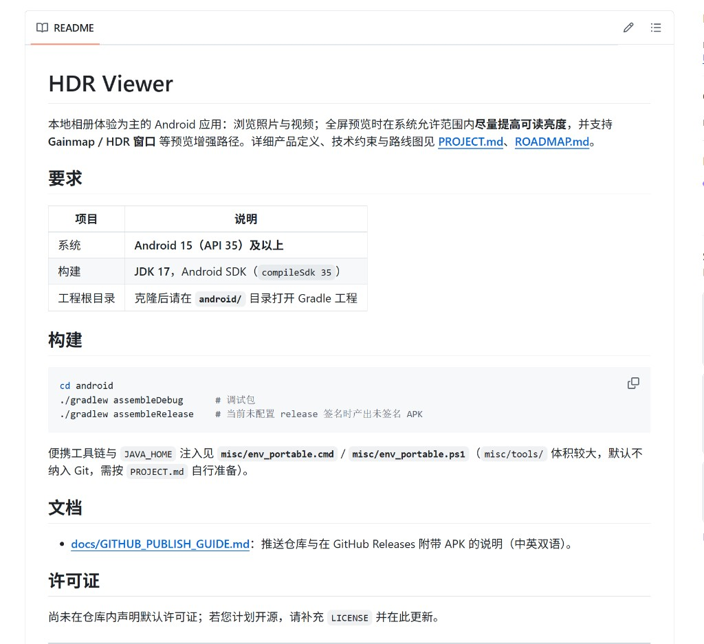
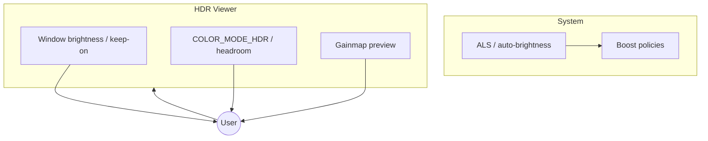

<!-- HDR Viewer — 中英双语说明；目录锚点依赖 GitHub 标题 slug，若跳转失效请使用浏览器「在页面中查找」。 -->

<div align="center">


# HDR Viewer

**本地相册体验 · 全屏可读亮度 · Gainmap / HDR 预览增强**

[中文文档](#中文文档) · [English](#english) · [PROJECT.md](PROJECT.md) · [ROADMAP.md](ROADMAP.md) · [Releases](https://github.com/JasonXie-Code/HDR_Viewer/releases)

</div>

---

## 目录（跳转链接）

| 语言 | 快速跳转 |
|------|----------|
| **中文** | [项目定位](#项目定位) · [为何限定 Android 15](#为何限定-android-15) · [仓库结构](#仓库结构) · [构建步骤](#构建步骤) · [亮度策略（示意）](#亮度与预览策略示意) · [配图说明](#配图说明) · [延伸阅读](#延伸阅读) |
| **English** | [What this app does](#what-this-app-does) · [Why Android 15](#why-android-15) · [Repository layout](#repository-layout) · [Build](#build) · [Brightness pipeline](#brightness--preview-pipeline) · [Figures](#figures) · [Further reading](#further-reading) |

---

## 中文文档

### 项目定位

**HDR Viewer** 是一款面向 **Android** 的相册类应用：启动后 **主界面即相册**（时间线 / 相册集合等），可浏览与整理 **本机照片与视频**（多数为 **SDR** 日常素材）。与「必须播放 HDR 电影片源」类产品不同，本项目的核心差异化在于：**在全屏查看时，在系统允许范围内尽可能抬高可读亮度与观感**，并可在预览链路中启用 **Gainmap、HDR 窗口 headroom** 等能力，使 **普通内容** 在户外或高光环境下更易阅读。

> **教育性说明（边界）**：手机在「阳光激发」下的极限亮度由 **面板、热设计、ALS、自动亮度策略** 等共同决定，**应用无法保证超过系统闭门算法**。本应用的目标是：在 **应用权限与 API 可达范围内用满**（例如窗口亮度、常亮、可选的系统亮度写入等），并在产品文案中诚实说明这一边界。详见 [PROJECT.md — 问题定义](PROJECT.md#问题定义)。

### 为何限定 Android 15

| 原因 | 说明 |
|------|------|
| **API 对齐** | 工程将 **minSdk / targetSdk / compileSdk** 设为 **35**，以统一使用 **`setDesiredHdrHeadroom`**、Ultra HDR / Gainmap 等与预览相关的现代 API，减少机型分支。 |
| **维护成本** | 缩小测试矩阵，使「户外高亮 / HDR 预览」路线可持续迭代；**minSdk 35** 的取舍见 [ROADMAP.md — 依赖与决策记录](ROADMAP.md#依赖与决策记录)。 |

因此：**低于 Android 15 的设备无法安装**；若需在旧系统运行，需单独评估降级与兼容性，不在当前主线路线图内。

### 仓库结构

```text
HDR_Viewer/
├── README.md                 ← 本文件（对外简介）
├── PROJECT.md                ← 产品与技术详细说明
├── ROADMAP.md                ← 阶段计划与里程碑
├── android/                  ← Gradle 工程根目录（请用 Android Studio 打开此目录）
├── misc/                     ← 便携脚本、环境注入、工具说明（misc/tools 体积大，默认不提交）
├── docs/                     ← 补充文档与配图（如 docs/images/）
└── Photos/                   ← 本地示例素材目录（默认不纳入 Git；需要时复制到 docs/images/ 再引用）
```

**为何强调打开 `android/` 而不是仓库根目录？** 因为 Gradle Wrapper、`settings.gradle.kts` 与模块均在 **`android/`** 下；在根目录打开会导致 IDE 无法识别工程。详见 [PROJECT.md — Android 应用工程](PROJECT.md#android-应用工程当前实现)。

### 构建步骤

1. **准备环境**：安装 **JDK 17** 与 **Android SDK**（含 API 35 平台）。若使用仓库推荐的便携布局，可在仓库根目录执行 **`misc\env_portable.cmd`**（cmd）或 **`. .\misc\env_portable.ps1`**（PowerShell）注入 `JAVA_HOME`、`ANDROID_*` 等（见 [PROJECT.md — 便携性与自包含约定](PROJECT.md#便携性与自包含约定)）。
2. **进入模块目录**并执行 Gradle：

```bash
cd android
./gradlew assembleDebug       # Windows: gradlew.bat assembleDebug
./gradlew assembleRelease     # 未配置 release 签名时，产出未签名 APK（用于测试）
```

3. **说明**：**`assembleRelease`** 在未配置签名时生成 **`app-release-unsigned.apk`**，适合自测与 [GitHub Releases](https://github.com/JasonXie-Code/HDR_Viewer/releases) 分发前的验证；**上架应用商店**需配置 **release 签名** 并遵守各平台政策。

### 亮度与预览策略（示意）

下图帮助理解「系统能力」与「应用侧预览增强」的分工（简化示意，非完整类图）：



更完整的工程说明见 [PROJECT.md — 两段式亮度滑块](PROJECT.md#两段式亮度滑块产品设想待实现)、[PROJECT.md — Android 工程现状](PROJECT.md#android-应用工程当前实现)。

### 配图说明

以下图片来自 **`docs/images/`**（其中样张由仓库旁 **`Photos/`** 复制而来，便于在 GitHub 上展示；根目录 **`Photos/`** 仍可能被 `.gitignore` 忽略，请勿依赖其直接出现在远程仓库）。

| 预览 | 说明 |
|:----:|------|
|  | **概念 Logo**：与 `misc/logo_concepts/` 设计一致，用于品牌识别。 |
|  | **相册内容示例**：示意本应用处理的典型静态影像场景（非功能截图）。 |
|  | **文档在 GitHub 上的渲染**：帮助新贡献者对照本地 Markdown 与网页效果。 |

### 延伸阅读

- **[PROJECT.md](PROJECT.md)**：产品边界、nit 话术、合规与开放问题。  
- **[ROADMAP.md](ROADMAP.md)**：里程碑与阶段任务。  
- **[docs/GITHUB_PUBLISH_GUIDE.md](docs/GITHUB_PUBLISH_GUIDE.md)**：推送仓库与 **Releases** 附带 APK（中英双语，含流程图）。  
- **许可证**：仓库尚未默认附带开源许可证；若计划开源，请添加 `LICENSE` 并在本文件更新说明。

---

## English

### What this app does

**HDR Viewer** is an **Android** gallery-style app: the **first screen is your library** (timeline / albums). It focuses on **local photos and videos** (mostly **SDR**). The differentiator is **fullscreen readability**: push brightness and rendering as far as **the platform allows**, and use paths such as **Gainmap** and **HDR window headroom** so everyday content stays readable in bright environments.

> **Important boundary**: peak “sunlight” brightness depends on **hardware, thermals, ALS, and OEM auto-brightness policies**. This app **cannot promise** to exceed the system’s closed-loop behavior; it aims to **fully use** what apps are allowed (window brightness, keep screen on, optional system brightness writes, etc.). Details: [PROJECT.md — 问题定义](PROJECT.md#问题定义).

### Why Android 15

The project sets **minSdk / targetSdk / compileSdk to 35** so preview-related APIs (**`setDesiredHdrHeadroom`**, Ultra HDR / Gainmap, etc.) stay consistent and the test matrix stays smaller. See [ROADMAP.md — Dependencies & decisions](ROADMAP.md#依赖与决策记录) (ADR: minSdk 35).

Devices **below Android 15 are not supported** by the current roadmap.

### Repository layout

```text
HDR_Viewer/
├── README.md
├── PROJECT.md
├── ROADMAP.md
├── android/          ← Open this folder in Android Studio (Gradle root)
├── misc/             ← Scripts & portable env (misc/tools is large; not committed by default)
├── docs/
└── Photos/           ← Local samples (often gitignored); copy into docs/images/ for README assets
```

### Build

1. Install **JDK 17** and **Android SDK** (API 35). Optional: run **`misc/env_portable.cmd`** or **`misc/env_portable.ps1`** to inject `JAVA_HOME` / `ANDROID_*` as described in [PROJECT.md](PROJECT.md#便携性与自包含约定).
2. Run:

```bash
cd android
./gradlew assembleDebug
./gradlew assembleRelease   # unsigned if signing is not configured
```

3. **Signing**: Unsigned release APKs are fine for **internal testing** and [GitHub Releases](https://github.com/JasonXie-Code/HDR_Viewer/releases); use a **release keystore** for store distribution.

### Brightness & preview pipeline



More detail: [PROJECT.md](PROJECT.md) (brightness / Gainmap sections).

### Figures

| Preview | Description |
|:-------:|-------------|
|  | Concept logo (see `misc/logo_concepts/`). |
|  | Sample still copied from **`Photos/`** for documentation context. |
|  | How this README may look when rendered on GitHub. |

### Further reading

- **[PROJECT.md](PROJECT.md)** — product definition and technical constraints.  
- **[ROADMAP.md](ROADMAP.md)** — roadmap and milestones.  
- **[docs/GITHUB_PUBLISH_GUIDE.md](docs/GITHUB_PUBLISH_GUIDE.md)** — push workflow and attaching APKs to Releases.  
- **License**: add a `LICENSE` file when you choose a license.

---

<div align="center">

<sub>仓库：<a href="https://github.com/JasonXie-Code/HDR_Viewer">github.com/JasonXie-Code/HDR_Viewer</a></sub>

</div>
