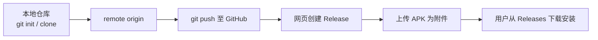
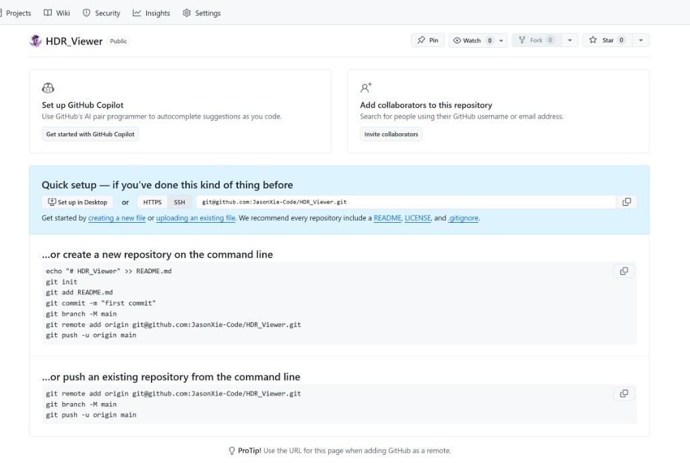

# GitHub 发布指南：推送代码与上传 Release APK

本文说明如何将 **HDR_Viewer** 推送到 GitHub，并在 **Releases** 中附带 **APK** 安装包。下图概括整体流程；细节见后文分步说明。

---

## 一、流程总览（中文）



**建议分工**：源代码由 **Git** 推送；**APK** 作为 **Release 资源**上传，避免将大体量二进制纳入 Git 历史（本仓库 `.gitignore` 已忽略 `*.apk`）。

| 对象 | 推荐做法 | 说明 |
|------|----------|------|
| 源码 | `git push` | 不含 `misc/tools/` 等巨型工具链 |
| APK | GitHub **Release → Assets** | 例如 `dist/` 中准备好的文件，仅作本地上传前的 staging |

### 1. 前置条件

- 已安装 **Git**，且本机可访问 GitHub（HTTPS 或 **SSH**）。
- 若使用 SSH，需将公钥添加到 GitHub：**Settings → SSH and GPG keys**。
- 远程仓库已创建（例如空仓库 `JasonXie-Code/HDR_Viewer`）。

### 2. 图解：空仓库「Quick setup」页

创建远程仓库后，浏览器会出现类似下方的说明页（**SSH** 地址形如 `git@github.com:JasonXie-Code/HDR_Viewer.git`）：



*图 1：在「push an existing repository」一节可看到 `git remote add origin` 与 `git push -u origin main` 命令。*

### 3. 首次推送已有项目（命令行）

在仓库根目录（含 `PROJECT.md`、`android/`）执行：

```bash
git init
git add .
git commit -m "Initial commit: HDR Viewer source"
git branch -M main
git remote add origin git@github.com:JasonXie-Code/HDR_Viewer.git
git push -u origin main
```

若远程已存在同名 `origin`，可改用：

```bash
git remote set-url origin git@github.com:JasonXie-Code/HDR_Viewer.git
git push -u origin main
```

**说明**：推送需网络与权限；若提示认证失败，请检查 SSH agent 或改用 HTTPS 远程 URL。

**若出现 `Host key verification failed`**：本机尚未信任 `github.com` 的 SSH 主机密钥。可在首次连接前执行（PowerShell 示例）：

```powershell
mkdir $env:USERPROFILE\.ssh -Force
ssh-keyscan github.com >> $env:USERPROFILE\.ssh\known_hosts
```

或改用 HTTPS 远程地址：`https://github.com/JasonXie-Code/HDR_Viewer.git`，推送时使用 **Personal Access Token** 或 **Git Credential Manager** 完成认证。

### 4. 构建 Release 用 APK（本地）

在配置好 **JDK 17** 与 **Android SDK** 的前提下（本机便携环境可执行 `misc\env_portable.cmd` 或 `misc\env_portable.ps1`），于 `android/` 目录：

```bash
cd android
./gradlew assembleRelease
```

当前工程未配置应用签名时，产物为 **未签名** APK，路径示例：

`android/app/build/outputs/apk/release/app-release-unsigned.apk`

可将该文件复制到仓库根目录的 **`dist/`**（便于与教程一致），例如：

`dist/HDRViewer-v0.1.0-release-unsigned.apk`

> **教学提示**：正式上架或大规模分发前，应配置 **release 签名** 并使用 `jarsigner`/`apksigner` 或 Android Studio **Generate Signed Bundle / APK**。本指南以「可安装的测试包」上传 GitHub Releases 为主。

### 5. 在 GitHub 上创建 Release 并上传 APK

1. 打开仓库主页，右侧进入 **Releases**（或地址栏追加 `/releases`）。
2. 点击 **Create a new release**。
3. **Choose a tag**：新建标签，例如 `v0.1.0`（与 `versionName` 对齐）。
4. **Release title**：例如 `HDR Viewer 0.1.0`。
5. 在 **Attach binaries** 区域，将本地 **`dist/` 中准备好的 `.apk`** 拖入或选择上传。
6. 发布 **Publish release**。

发布后，访问者可在 **Assets** 中直接下载 APK，无需从源码编译。

```text
GitHub 仓库页
    └── Releases
            └── v0.1.0
                    └── Assets
                            └── HDRViewer-v0.1.0-release-unsigned.apk  ← 用户下载
```

### 6. 教程配图（可选）

若需补充「Releases 按钮」「上传附件」等截图，可将您放在仓库根目录 **`Photos/`** 下的截图复制到 **`docs/images/`**，并在本 Markdown 中引用，例如：

```markdown

```

这样文档在 GitHub 上可正常渲染图片，且避免将大量私人照片目录纳入版本控制（`Photos/` 已在 `.gitignore` 中忽略）。

---

## 二、Overview (English)

This guide explains how to push **HDR_Viewer** to GitHub and attach an **APK** under **Releases**, without committing large binaries to Git history.

### 1. High-level flow


| Artifact | Recommended channel | Notes |
|----------|---------------------|-------|
| Source | `git push` | Toolchains under `misc/tools/` are excluded by `.gitignore` |
| APK | **Release assets** | Keep APKs out of Git; use staging dir `dist/` locally |

### 2. Illustrated: empty repo “Quick setup”

After creating an empty GitHub repository, the **Quick setup** page shows the remote URL and push instructions:


*Figure 1: Use the “push an existing repository” block for `git remote add origin` and `git push -u origin main`.*

### 3. Push an existing project

From the repository root:

```bash
git init
git add .
git commit -m "Initial commit: HDR Viewer source"
git branch -M main
git remote add origin git@github.com:JasonXie-Code/HDR_Viewer.git
git push -u origin main
```

If `origin` already exists, use `git remote set-url origin <url>` then `git push -u origin main`.

**Troubleshooting — `Host key verification failed`**: add GitHub’s host key to `~/.ssh/known_hosts` (e.g. `ssh-keyscan github.com >> ~/.ssh/known_hosts` on Unix-like shells), or switch the remote to **HTTPS** (`https://github.com/JasonXie-Code/HDR_Viewer.git`) and authenticate with a **PAT** or **Git Credential Manager**.

### 4. Build a release APK

With **JDK 17** and **Android SDK** configured (see `misc/env_portable.*` for the portable layout):

```bash
cd android
./gradlew assembleRelease   # Windows: gradlew.bat assembleRelease
```

Without a release signing config, Gradle outputs an **unsigned** APK, e.g.  
`android/app/build/outputs/apk/release/app-release-unsigned.apk`.  
Copy it to `dist/HDRViewer-v0.1.0-release-unsigned.apk` for a clear, versioned filename before upload.

For production distribution, configure **signing** and ship a properly signed APK or AAB.

### 5. Create a GitHub Release and attach the APK

1. Open the repo → **Releases** → **Create a new release**.
2. Create a new tag (e.g. `v0.1.0`) matching your `versionName`.
3. Add a title and release notes.
4. Under **Assets**, upload the APK from `dist/`.
5. **Publish release**.

Users will download the APK from **Assets**, not from the source tree.

### 6. Optional screenshots

Place additional screenshots under **`docs/images/`** and reference them from this file. You may copy images from the local **`Photos/`** folder into `docs/images/` for documentation only (`Photos/` remains gitignored).

---

*文档与 `.gitignore` 策略以 `PROJECT.md` 为准；Gradle JDK 路径请在本机配置，勿将含私机盘符的 `org.gradle.java.home` 提交到公共仓库。*
